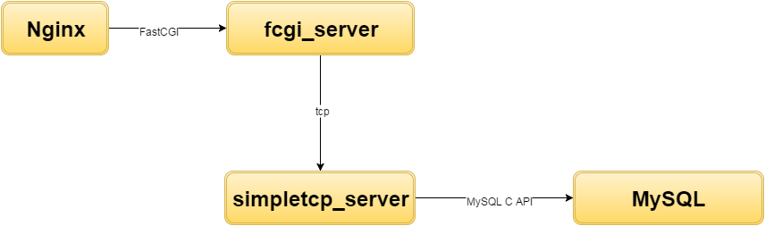

C++ based FCGI server + tcp backend implementation
=====================================================

### Setup
**The original project is set up on Vagrant with a CentOS 7 box. Please consider use Vagrant for setting up and running this project. If you prefer just Virtual Box setup by hand or using docker, please have a look at "bootstrap.sh".**

1. Install Vagrant [here](https://docs.vagrantup.com/v2/getting-started/index.html)
2. Clone the repo.
3. Navigate to project folder and run <code>vagrant up</code> and the setup of environment is done.

### Running Server
1. SSH into the virtual machine. Go the default synced folder(in CentOS' vase, it is "/home/vagrant/sync"). Navigate into src folder. Run <code>make</code>. This should compile and build all necessary files.
2. Run <code>./simple_tcpserver 5432</code>(If you change the param here, remember to change the port setting in backend_connection.cpp as well and rebuild).
3. (Open another terminal and) Run <code>spawn-fcgi -p 8000 -n fcgi_server</code>. You can change the port definition here. But remember to change the Nginx configuration file specified as below as well. Now you should see the TCP connection between simpletcp_server and fcgi_server is establised.
4. Navigate into "/etc/nginx" and edit the server configuration:

   ```
       server {
           listen       80 default_server;
           listen       [::]:80 default_server;
           server_name  _;
           root         /var/www;
           # Load configuration files for the default server block.
           # include /etc/nginx/default.d/*.conf;
           location / {
               fastcgi_pass 127.0.0.1:8000;
               include /etc/nginx/fastcgi_params;
           }
           error_page 404 /404.html;
               location = /40x.html {
           }
           error_page 500 502 503 504 /50x.html;
               location = /50x.html {
           }
       }
   ```
5. <code>curl localhost/welcome</code> and you should see the html response.

**When launching the servers, run tcp server first for accepting connections. And when closing servers, shut down fcgi server first to close socket connection first.**

### Design
The design of the web server is as follows: .

So basically Nginx will forward all requests with mapped url to fcgi_server processes listening to port 8000 launched by spawn-fcgi. And if database connection is needed, fcgi_server will send tcp requests to tcpserver for data. After that tcpserver will be query MySQL via MySQL C API and return results through tcp to fcgi_server. And fcgi_server will generate html response and return to nginx.

1. fcgi_server<br>
   fcgi_server.cpp is the entry point of fcgi_server. Basically it is accepting incoming requests and based on the url, it will dispatch task to cooresponding subroutines such as "welcome_user", "login_user", "display_user" and so on. For tasks like "login_user" that requires database connection, the query parameters will be sent over tcpclient to tcpserver for connection. Another task "update_pic" will also writing png file to disk.

2. tcpserver<br>
   tcpserver.cpp is the entry point of tcpserver. So first it is trying to create and bind a socket on the specified port. Then the socket will be set to be non_blocking with fcntl() system call. After that epoll_ctl() will be invoked and for incoming requests on the listening socket afterwards, they will be set to non blocking and added to epoll monitoring.

### Analysis
The design has successfully decoupled the concern of html response and database connection and by using different efficient protocols or implementations, the performance requirements are met as well. However, some issues are not well addressed in the current implementation and there is plenty of room for improvement.
1. file uploading functionality is still inside fcgi_server. Well this could be efficient as we are just writing file to disk directly, it is not scalable. Also if more requirements about security like file type valiation ans size constraints are added, fcgi_server implementation has to be modified.
2. as pointed in the item above, security issues like file type valiation and file size constraints are not imposed by the current implementation, which is not a good practice for wep app security. A more severe issue is probably how we handle login right now, passwords are not encrypted in any way and the login state is denoted by setting username in cookie, which is just dirty and insecure.
3. further performance enhancement could be done by using prepared statements of MySQL C API, whose effect is more visible when database and tcpserver comunication has to be done via network.
4. using Ajax technology on browser and design fcgi_server to respond with JSON for APIs would be another enhancement. With Ajax and Restful APIs, frontend rendering is pretty much on browser only and server is only responsible for responding data, which is further decoupling different concerns and once page is loaded, network load could be reduced as well.
5. caching could have been done to improve performance as well. Also in this case htmls are not big in size, and it seems database part is also very simple. caching reponses would always be a plus for performance if done right.

### Benchmarking
Benchmarking scripts are in scripts folder. You can change the number of processes and requests per process by editting "launcher.sh" and "benchmark.py". Results:

| # | # of requests in total | Time |
|---| ---------------------- | ---- |
| 1 | 2000 | 2 |
| 2 | 2000 | 2 |
| 3 | 2000 | 1 |
| 4 | 2000 | 2 |
| 5 | 2000 | 2 |
| 6 | 8000 | 8 |
| 7 | 8000 | 8 |
| 8 | 8000 | 8 |
| 9 | 8000 | 8 |
| 10 | 8000 | 8 |
| 11 | 16000 | 16 |
| 12 | 16000 | 16 |
| 13 | 16000 | 15 |
| 14 | 16000 | 16 |
| 15 | 16000 | 16 |
| 16 | 32000 | 30 |
| 17 | 32000 | 31 |
| 18 | 32000 | 30 |
| 19 | 32000 | 33 |
| 20 | 32000 | 32 |

### Conclusion
Through implementation of this project, many technologies and techniques are explored and tried out and there are really a lot of learnings. Things like "FastCGI vs CGI", "Nginx serving FastCGI", "tcp", "epoll" have successfully enriched programming experiences. Also the focus on design and performance has enabled a lot of learnings.

So firstly the understanding of the requirements is not very clear and a C++ web framework [CppCMS](http://cppcms.com/wikipp/en/page/main) was chosen. However, after talking to mentor @Yu_le and I figured that this does not meet the decoupling of html response and backend. So I studies CGI scripts and decided to use a library called "fcgiwrap" to wrap CGI processes as FastCGI to be served by Nginx server. And then @Lin_fen told me that "mostly this is not going to meet the performance requirements" and I settled down with the fcgi C++ library(It was already Thursday when this "settling down" happend).

After that I implemented fcgi_server and tcpserver. But the performance is not good enough and I figured that overhead of setup of tcp connections and db connections is the bottle neck and after sharing on connection in tcp clients and one db connection for tcp_server the performance is OK. Saving png files was also challenging for me as the saved could not be viewed as png files. I searched online(honestly, I think resources regarding this are not many, well, too few. And probably this is another reason why there is just so much learning for me--make use of the limited resources and really dig into the source code and see) and finally succeeded with "try and error". (Lack of experience with Nginx was another challenge but I will pass on this as that was when I searching about using fcgiwrap serving CGI scripts on Nginx. Serving CGI on Apache is just so easy when compared to it. But probably there is not much need for CGI scripts anyway compared to FastCGI now)

As mentioned in "Analysis" part, there are still many optimization and enhancements that could have been done but due to time limit, I will deliver the project as it is now.
